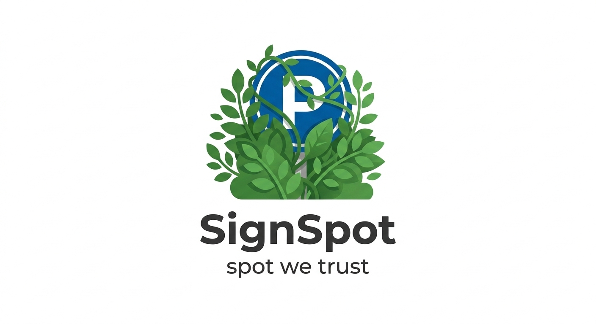

# 🅿️ SignSpot



> **Community-driven app to find free parking and report problematic paid parking worldwide**

🚀 **[Launch App →](https://signspot.streamlit.app/)**

[](https://doi.org/10.5281/zenodo.18874701)

## What is SignSpot?

A crowdsourced map where drivers report and vote on parking areas worldwide. Find free spots, warn others about tricky paid parking (hidden signs, damaged signs, unclear markings), and help everyone navigate complex parking landscapes.

## 🎯 Key Features

- 🗺️ **Interactive Map** - Click anywhere to report parking
- 🔴 **Paid Parking (Problematic)** - Hidden, faded, damaged, or unclear paid parking signs
- 🟢 **Free Parking** - Free parking spots (great finds!)
- 👍👎 **Vote on Reports** - Upvote accurate reports, downvote incorrect ones
- 🚩 **Flag Spam** - Community moderation for data quality
- 📊 **Trust Scores** - See agreement % and net votes
- 💾 **Real-time Updates** - All reports stored and synced instantly

## What to Report

**🔴 Paid Parking (Report these to warn others):**
- Hidden parking signs (behind trees, bushes, poles)
- Faded or unclear signs (hard to read)
- Missing signs (parking is paid but no sign visible)
- Damaged signs (broken or vandalized)

**🟢 Free Parking (Great finds!):**
- Street parking with no paid signs
- Free parking zones
- Community-verified free spots

## 🏃 Quick Start

### Online (Recommended)
Visit **[signspot.streamlit.app](https://signspot.streamlit.app/)** - No installation needed!

### Run Locally
```bash
git clone https://github.com/ramtinz/SignSpot.git
cd SignSpot
pip install -r requirements.txt
streamlit run main.py
```

## 📖 How to Use

1. **Map View** - See all parking reports on the map
2. **Click Location** - Select where you want to report, or use "🔄 Use My Location" for current GPS position
3. **Choose Type** - Problematic Paid Parking or Free Parking
4. **Add Details** - Use presets or type custom description
5. **Vote** - Upvote/downvote existing reports to verify accuracy

## 🛠️ Tech Stack

- **Framework**: Streamlit
- **Maps**: Folium + OpenStreetMap
- **Database**: SQLite
- **Hosting**: Streamlit Cloud

## 📄 License

Non-Commercial License © 2026 Ramtin Zargari Marandi

Free for non-commercial use. Commercial use requires permission. See [LICENSE](LICENSE) for details.

## 🤝 Collaboration & Enquiries

For collaboration, feedback, or project enquiries, contact:

**ramtin.zargari AT gmail.com**

## 📚 Citation & DOI

[](https://doi.org/10.5281/zenodo.18874701)

To cite this project:

```bibtex
@software{zargari_marandi_2026_signspot,
  author       = {Zargari Marandi, Ramtin},
  title        = {SignSpot},
  year         = 2026,
  publisher    = {Zenodo},
  doi          = {10.5281/zenodo.18874701},
  url          = {https://doi.org/10.5281/zenodo.18874701}
}
```

Citation metadata is also available in [CITATION.cff](CITATION.cff).

## ⚠️ Disclaimer

**Use at your own risk.** SignSpot is a crowdsourced app - data accuracy depends on community contributions. Always verify parking rules yourself before parking.

**Legal Responsibility:** Users are solely responsible for ensuring that their use of SignSpot complies with applicable laws and regulations in their country and local jurisdiction. The use of this app is intended only for legal purposes. The developer assumes no responsibility for any legal consequences resulting from users' use of the app in violation of local, regional, or national laws.

---

**Find free parking, warn others about tricky spots! 🅿️✅**
